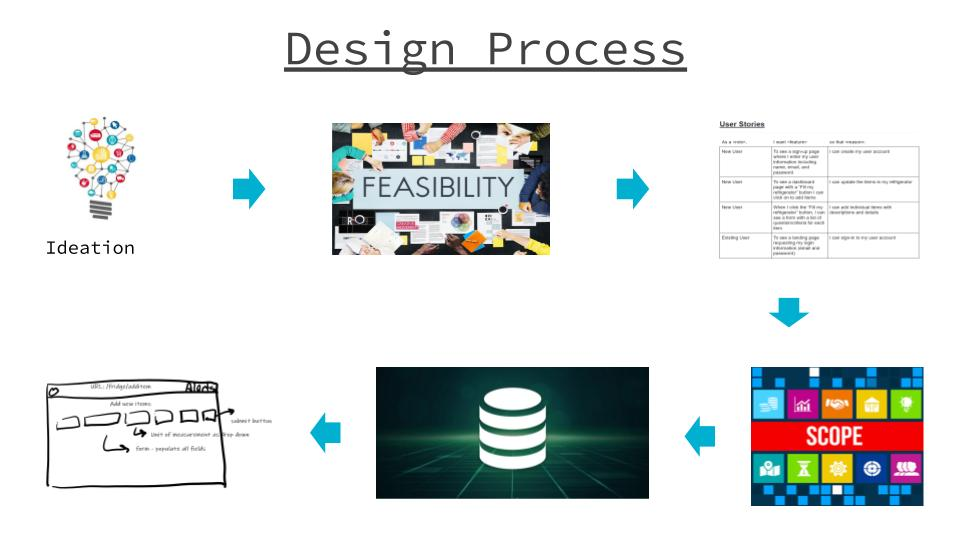
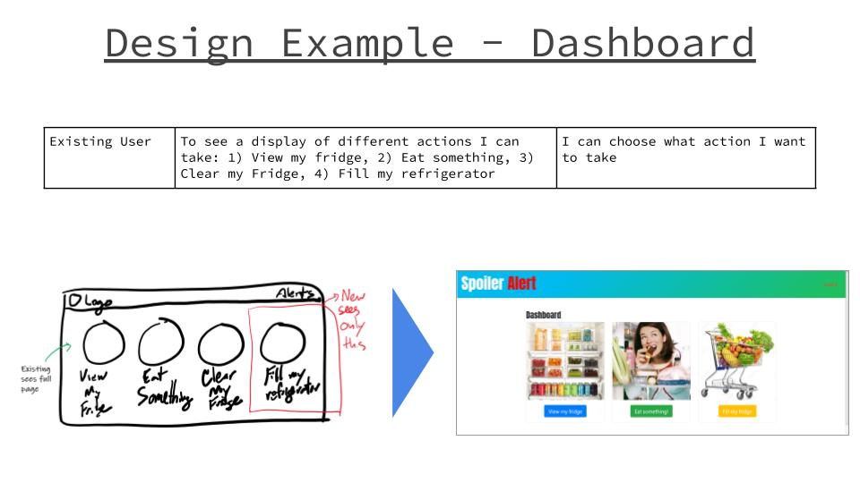
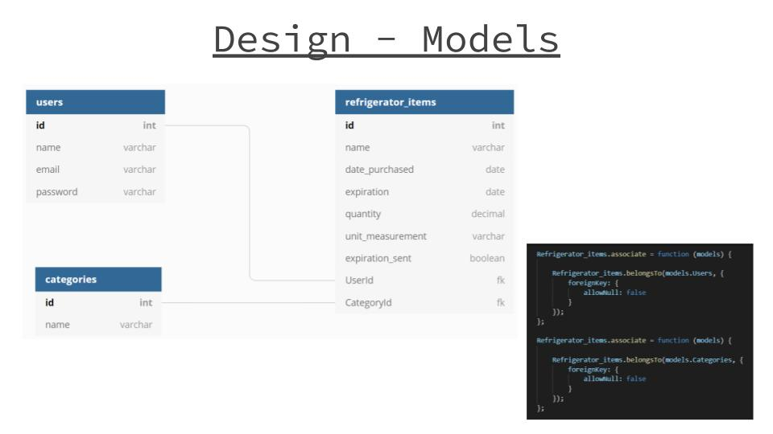

# Spoiler Alert!
## helping you use it, before you lose it
https://refritrack.herokuapp.com/ | https://git.heroku.com/refritrack.git

[](https://github.com/dwyl/esta/issues)


## Description
Spoiler Alert! is a food inventory and status tracking application. Users can sign-in to view items, add items, update item quantities, and remove items from their refrigerator. When items near their expiration date, Spoiler Alert! will send an alert to the user’s email informing him/her of the item that is near expiration. 


## Table of Contents
* [Background](#background)
* [Motivation](#motivation)
* [Design](#design)
* [Technology](#technology)
* [Code](#code)
* [Site](#site)
* [License](#license)
* [Contributing](#contributing)
* [Questions](#questions)
* [Authors](#authors)

## Background
Spoiler Alert was created for Project 2 of the UC Berkeley full-time web development coding bootcamp. Requirements for this project are noted below:

```
* Must use a Node and Express Web Server
* Must be backed by a MySQL Database with a Sequelize ORM 
* Must have both GET and POST routes for retrieving and adding new data
* Must be deployed using Heroku (with Data)
* Must utilize at least one new library, package, or technology that we haven’t discussed
* Must have a polished frontend / UI
* Must have folder structure that meets MVC Paradigm
* Must meet good quality coding standards (indentation, scoping, naming)

```

## Motivation

Ever forget to cook that expensive tomahawk steak you purchased two weeks ago only to find out that it’s now gray and rotten? Or return home from the grocery store only to find that you still have a dozen eggs left and now you have a dozen more? Or that you’re out of stock of the crucial ingredients you need to make your favorite recipe?

Managing the inventory of your refrigerator is more complicated than we often think. 

Spoiler Alert helps users keep track of the items in their refrigerators. Our dashboard allows users to view the items that they have in stock, add new items, update quantities, and remove items. Spoiler Alert also includes an alert system that will email users once their items are near their expiration dates. Shopping and you can’t remember what ingredients you already have? Simply check your dashboard. Expensive ingredients about to expire? Receive a notification before your food goes bad. Spoiler Alert is your single-stop resource for knowing the contents of your refrigerator.

## Design



The above process was used to design the application. Below is an example of how are user stories informed our wireframes which were then translated into functioning components:



In addition, below is the end design of our models:



As shown above, users can have many refrigerator items and categories can have many refrigerator items (both are foreign keys for refrigerator items).

This project featured several areas which required specific focus:
1)


## Technology

* [html5]()
* [CSS]()
* [JS](https://developer.mozilla.org/en-US/docs/Web/JavaScript)
* [jquery](https://jquery.com/)
* [mysql](https://www.mysql.com/)
* [mysql2 NPM]()
* [express](https://expressjs.com/)
* [express-session](https://www.npmjs.com/package/express-handlebars)
* [Bootstrap]()
* [Nodemailer]()
* [Passport]()
* [Passport-Local]()
* [Passport]()
* [Sequelize]()
* [Moment]()
* [Dotenv]()

## Code

## Site

* [See Live Site](https://refritrack.herokuapp.com/)

## License
MIT

## Contributing
Contributions are welcome. Please contact for further details.

## Questions
If you have any questions regarding this project, please email shambhawi.kumari1393@gmail.com.

## Authors

* **CHRISTOPHER LEE** 

- [Link to Github](https://github.com/CofChips)
- [Link to LinkedIn](https://www.linkedin.com/in/christophernlee/)

* **SHAMBHAWI KUMARI** 

- [Link to Github](https://github.com/shambhawi13)
- [Link to LinkedIn](https://www.linkedin.com/in/shambhawi-kumari/)

* **SERGIO LOPEZ** 

- [Link to Github](https://github.com/Cherjios)
- [Link to LinkedIn](https://www.linkedin.com/in/sergio-lopez-81790579/)
